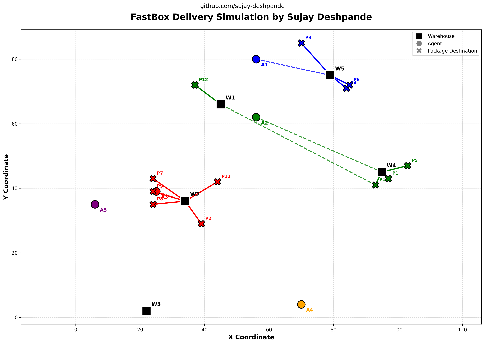

# Assignment - Mystery Delivery System

Solved the assignment as a small logistics simulation built to model a one-day package delivery workflow for a fictional delivery company called **FastBox**.

The system simulates warehouses, delivery agents, and package assignments using Euclidean distance. It assigns packages to the nearest available delivery agent, calculates travel distances, generates reports, and visualizes routes.

---

## Assignemtn Overvie

This assignment was developed to simulate how package deliveries can be assigned and executed in a simple logistics environment.

The workflow includes:

- Reading delivery input from JSON
- Assigning packages to agents
- Simulating deliveries
- Calculating total travel distance
- Measuring delivery efficiency
- Finding the best-performing delivery agent
- Exporting reports
- Visualizing routes

The implementation is intentionally modular so that each responsibility remains isolated and easier to maintain.

## Run the Project
Install all the required libraries 

Default input:

```bash
python main.py
```

Custom input file:

```bash
python main.py custom_data.json
```

---

## Project Structure

```txt
.
├── main.py
├── data.json
├── report.json
├── report.csv
├── delivery_simulation.png
├── modules
│   ├── distance.py -> Euclidean distance calculation
│   ├── normalizer.py -> json parsing 
│   ├── simulator.py -> nearest agent mapping 
│   ├── export.py -> report exporting 
│   └── visualize.py -> visualization
└── README.md
```

---

## Why I Modularized the Code

Instead of writing everything inside one large script, I split the project into smaller modules to improve readability, maintainability, and debugging.

Each module is responsible for one task.

| Module | Responsibility |
|---|---|
| `distance.py` | Distance calculation logic |
| `normalizer.py` | Input normalization and JSON formatting |
| `simulator.py` | Core delivery simulation logic |
| `export.py` | Report generation and export |
| `visualize.py` | Route visualization |

This helped keep `main.py` simple and focused only on execution flow.

---

## Input JSON Format

The simulator expects a structured JSON input file containing:

### Required Fields

| Field | Required | Description |
|---|---:|---|
| `warehouses` | ✅ | Warehouse coordinates |
| `agents` | ✅ | Agent coordinates |
| `packages` | ✅ | Package delivery information |

### Optional Fields

| Field | Required | Description |
|---|---:|---|
| `new_agents` | ❌ | Dynamically joining agents during execution |

### Expected Structure

```json
{
  "warehouses": {},
  "agents": {},
  "packages": [],
  "new_agents": []
}
```

> `new_agents` is optional.  
> For the complete input structure and formatting, refer to `data.json`.

---

## Execution Flow

The program follows this pipeline:

```txt
JSON Input -> Normalize Data -> Assign Packages -> Run Delivery -> Generate Report -> Visualize Routes
```

---

## How the System Works

The simulator processes packages one-by-one.

For every package:

1. Find the package warehouse
2. Find the nearest currently active delivery agent
3. Assign package to that agent
4. Simulate delivery:

```txt
Agent -> Warehouse -> Destination
```

5. Update the agent's position after delivery
6. Repeat for remaining packages

At the end:

- total distance travelled is calculated
- packages delivered are counted
- efficiency is measured
- best performing agent is selected

---

## Logic Assumptions Made

### 1. Distance Calculation

Delivery distance is calculated using **Euclidean distance**.

Distance for each package is computed as:

```txt
Agent -> Warehouse -> Destination
```

Formula used:

```txt
distance(agent, warehouse) + distance(warehouse, destination)
```

---

### 2. Package Assignment Strategy

Packages are assigned to the **nearest currently active agent** based on the distance between:

```txt
agent current position -> package warehouse
```

Only currently active agents are considered.

---

### 3. Dynamic Agent Joining

New agents can join during execution using:

```json
"new_agents"
```

`join_after_package` determines after how many package iterations an agent becomes active.

Newly joined agents:

- only participate in future assignments
- do not inherit already assigned deliveries

---

### 4. Routing Order

Packages are processed in the same order as provided in the input JSON.

No advanced optimization is applied such as:

- shortest global route optimization
- batching deliveries
- route compression

---

### 5. Agent Position Updates

After completing a delivery, the agent’s effective position changes to:

```txt
package destination
```

This updated location is used for future package assignments and distance calculations.

---

### 6. Warehouse Resolution

Every package must reference a valid warehouse.

If a warehouse ID is invalid or missing:

```txt
package is skipped
```

---

### 7. Tie-breaking Rule

If two agents are equally close to a warehouse, Python's `min()` selection order decides the winner.

Effectively:

```txt
input order precedence
```

is applied.

---

### 8. Efficiency Metric

Efficiency is calculated as:

```txt
Total Distance Travelled
/
Packages Delivered
```

Lower values are considered better because the agent travels less distance per package.

---

### 9. Best Agent Selection

The best agent is selected using:

```txt
lowest efficiency score
```

Only agents who delivered at least one package are considered.

Agents with zero deliveries are excluded.

---

### 10. Visualization Assumptions

The route visualizer assumes a **2D coordinate system**.

The plot displays:

- warehouses
- agents
- package destinations
- route lines

Coordinates are drawn proportionally to the input positions.

---

### 11. Input Normalization

The system accepts warehouses and agents in multiple formats:

Dictionary format:

```json
"agents": {
  "A1": [5,5]
}
```

or list format:

```json
[
  {
    "id": "A1",
    "location": [5,5]
  }
]
```

Internally, everything is normalized into a consistent structure.

---

## Why Nearest Agent Was Chosen

I explored multiple assignment approaches before implementation.

Since the assignment explicitly mentions:

> assign package to the nearest agent using Euclidean distance

the nearest-agent strategy was selected.

| Strategy | How It Works | Why Not Used |
|---|---|---|
| Nearest Agent ✅ | Assigns package to closest active agent | Matches assignment requirement and realistic logistics |
| Round Robin | Cycles agents sequentially | Ignores actual distance and causes inefficient routing |
| Weighted Round Robin | Assigns based on predefined weights | Requires external weighting logic not present in requirements |
| Load Balancing | Equalizes package count among agents | Optimizes fairness, not travel efficiency |

Nearest-agent assignment also better represents real delivery systems because reducing travel distance improves delivery efficiency.

---

## Most Significant Technical Challenge

The biggest technical challenge during this assignment was designing a delivery assignment system that remained correct even when:

- new agents join during execution
- agent positions change after deliveries
- package assignment depends on current location

Initially, it looked straightforward to assign packages statically.

However, once dynamic agents and moving positions were introduced, package assignment had to happen sequentially while keeping track of the latest state of the system.

To solve this:

1. I normalized input data into a consistent structure.
2. I processed packages one at a time.
3. I maintained an `active_agents` list.
4. I updated agent positions after every delivery.
5. I recalculated nearest-agent assignment dynamically instead of using fixed allocation.

This made the simulator flexible enough to work with multiple JSON inputs and dynamic scenarios.

---

## Installation

Clone the repository:

```bash
git clone <repository-url>
cd fastbox-delivery-simulator
```

Install dependencies:

```bash
pip install numpy pandas matplotlib
```

---

## Output Files

After execution:

| File | Description |
|---|---|
| `report.json` | Final delivery report |
| `report.csv` | Tabular report |
| `delivery_simulation.png` | Delivery route visualization |

---

## Example Report

```json
{
  "A1": {
    "packages_delivered": 2,
    "total_distance": 121.21,
    "efficiency": 60.61
  },
  "A2": {
    "packages_delivered": 2,
    "total_distance": 79.21,
    "efficiency": 39.60
  },
  "A3": {
    "packages_delivered": 1,
    "total_distance": 14.14,
    "efficiency": 14.14
  },
  "best_agent": "A3"
}
```

## Example Delivery Simulation

   

---

## Author

**Sujay Deshpande**

Assignment: **FastBox Delivery Simulator**